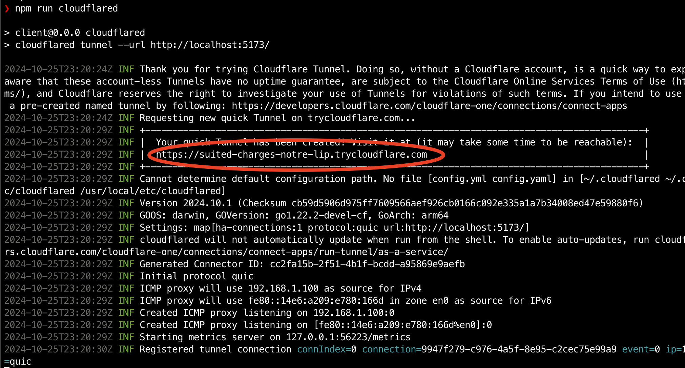

# KAPLAY + Colyseus

Boilerplate to quickstart a project using [KAPLAY](https://kaplayjs.com/) and [Colyseus](https://colyseus.io/) Multiplayer Framework.

> This project was made for the first [KAJAM](https://itch.io/jam/kajam) + Colyseus challenge/collab.

## Running locally

Open 2 terminal windows, one for the client and one for the server. Install the dependencies and run the development server.

**Start the client:**

```bash
cd client
npm install
npm start
```

**Start the server:**

```bash
cd server
npm install
npm start
```

## Testing with friends

You will need to expose your local server to the internet to test with friends. We recommend using either [cloudflared](https://www.npmjs.com/package/cloudflared) or [ngrok](https://ngrok.com/) for this.

```
cd client
npm run cloudflared
```

You can copy the URL generated by `cloudflared` and share it with your friends:



## Have fun!

Have fun and make awesome games! 🎮

## Contributing

Feel free to contribute to this project. We are open to suggestions and improvements.

## License

MIT

(_This project was slightly based on [tejaboy/discord-kaboom-colyseus](https://github.com/tejaboy/discord-kaboom-colyseus)_)
